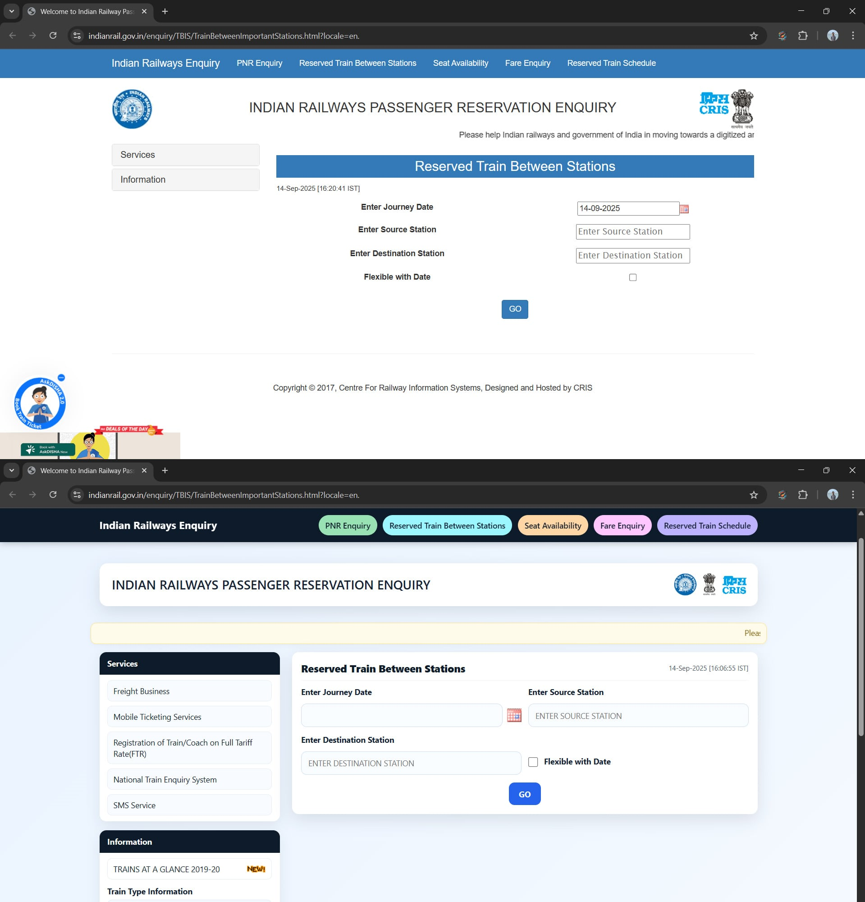

#  VibeFusion

VibeFusion is an AI-powered Chrome extension that lets you redesign any website with a single click. Using the power of OpenAI, this extension can change the layout, style, and theme of a webpage while preserving the original content.

## Features

- **One-Click Redesign:** Instantly transform the look and feel of any website.
- **AI-Powered:** Leverages OpenAI to generate creative and unique designs.
- **Preserves Content:** Keeps the original text and information intact.
- **Simple Interface:** Easy to use, with a minimal and intuitive popup.

## Screenshots

| VibeFusion Extension Screenshots |
| --- |
|  |

| Before & After Screenshots | |
| --- | --- |
| Berkshire Hathaway Website | Example.com |
|  |  |
|  |  |
| IRCTC Inquiry | SSI Homepage |
|  |  |

## Demo Video

## How to Use

1.  **Add your OpenAI API Token:**
    *   Click on the VibeFusion icon in your Chrome toolbar.
    *   Paste your OpenAI API token into the input field and click "Save".
2.  **Redesign a Website:**
    *   Navigate to the website you want to redesign.
    *   Click the VibeFusion icon.
    *   Click the "Redesign Website" button.
    *   Wait for the AI to work its magic. The page will be updated with a new design.

## Installation

Since VibeFusion is not yet on the Chrome Web Store, you can install it manually by following these steps:

1.  **Download the code:** Clone or download this repository to your local machine.
2.  **Open Chrome Extensions:** Open Google Chrome and navigate to `chrome://extensions`.
3.  **Enable Developer Mode:** Turn on the "Developer mode" toggle in the top right corner.
4.  **Load the extension:**
    *   Click the "Load unpacked" button.
    *   Select the directory where you downloaded the VibeFusion code.
5.  **Pin the extension:** Click the puzzle piece icon in the toolbar and pin the VibeFusion extension for easy access.

## Technologies Used

-   HTML
-   CSS
-   JavaScript
-   [OpenAI API](https://beta.openai.com/docs/)